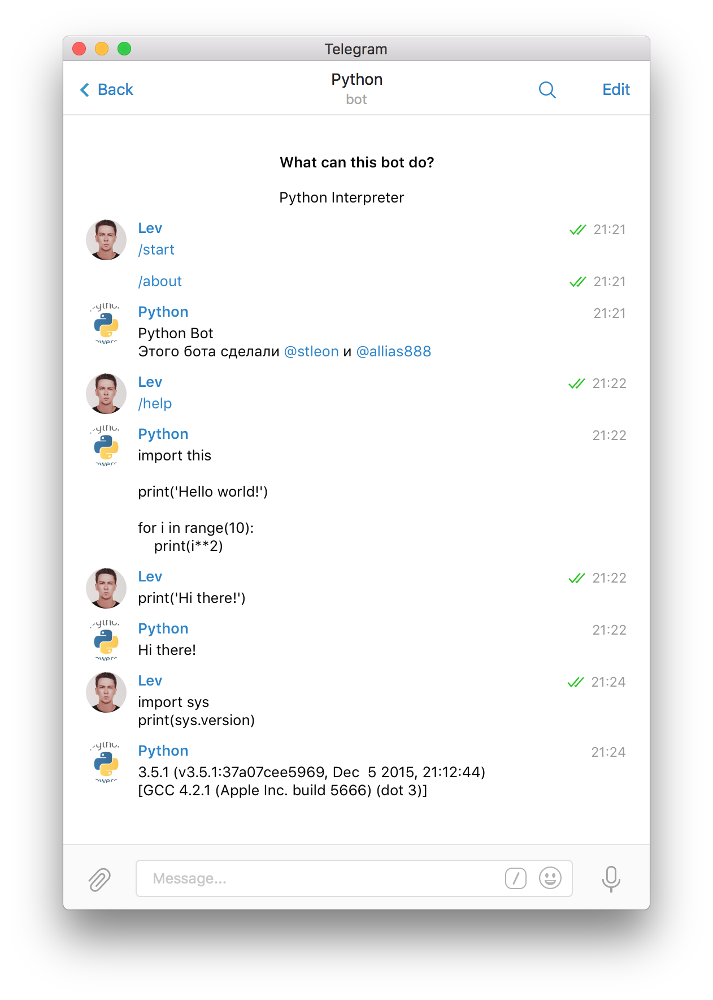

# PythonBot

Python Telegram Bot

## Main idea

We all love the **Python Interpreter**:

We want:

- Get out anywhere without laptop
- Quickly test any code sitting in a park or somewhere else
- Share result

And now you can send command to [@PythonAwesomeBot](https://telegram.me/PythonAwesomeBot) like to **Python Interpreter** like this:

And its cool

Full presentation you can find [here](https://www.youtube.com/watch?v=eYeqtUCiERU).